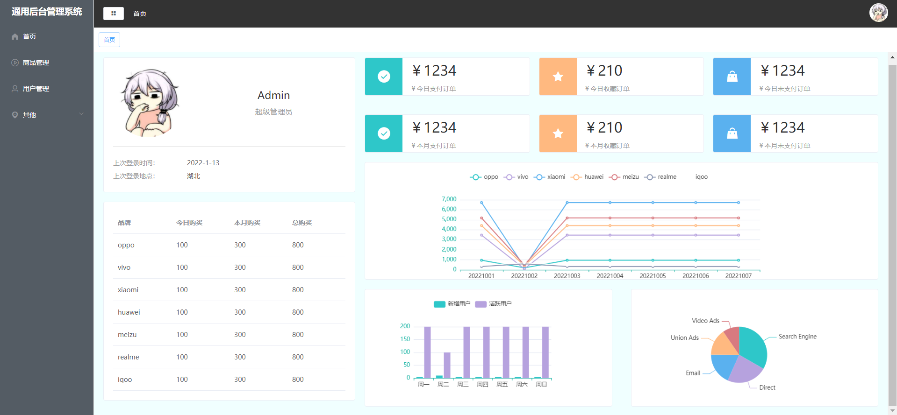

# vue-manage-project

## Project setup
```
yarn install
```

### Compiles and hot-reloads for development
```
yarn serve
```

### Compiles and minifies for production
```
yarn build
```

### Lints and fixes files
```
yarn lint
```

<<<<<<< HEAD
### 预览图

=======
### Customize configuration
See [Configuration Reference](https://cli.vuejs.org/config/).
>>>>>>> 997830c9fda7d9168eaa7cfb1dccc86a0c948b76
